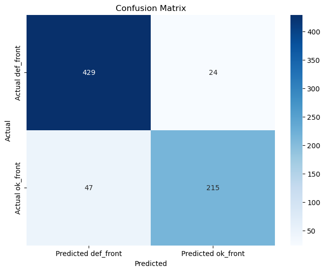

# 📸 AI for Visual Quality Control

### **Project Objective**
To build a deep learning model that can automatically perform visual quality inspection. I trained a Convolutional Neural Network (CNN) to classify images of metal castings as either "defective" or "ok," proving a concept for automated quality control on a production line.

### **Tools Used**
* **Python:** The core programming language.
* **TensorFlow & Keras:** For building and training the deep learning model.
* **Pandas & Matplotlib:** For data handling and visualization.
* **Transfer Learning:** Used the `MobileNetV2` model, pre-trained on millions of images, as a base to speed up training and improve accuracy.

---

## 📈 The Process

### 1. Data Loading
The dataset consisted of ~7,300 images of metal castings, pre-sorted into `train` and `test` folders with `def_front` (defective) and `ok_front` (good) sub-categories. I used Keras's `image_dataset_from_directory` to load, resize, and label this data efficiently.

### 2. Data Augmentation
To make the model more robust, I added a data augmentation layer. This layer automatically applied random flips and rotations to the training images. This teaches the model to recognize a defect regardless of the part's orientation.

### 3. Transfer Learning
Instead of training a model from scratch, I used **Transfer Learning**.
1.  Loaded the `MobileNetV2` model, which was pre-trained by Google on the ImageNet dataset.
2.  "Froze" the original model's layers.
3.  Added my own "head" (a new set of layers) to classify our specific task: `def_front` vs. `ok_front`.

### 4. Training
I trained the model for 10 epochs. The training plots showed a classic, ideal learning curve where both training and validation accuracy rose to ~90% while the loss decreased.

---

## 📊 Results & Key Insights

The final model was evaluated on a "test set" of 715 images it had never seen before.

* **Final Test Accuracy: 90.1%**

The confusion matrix below shows the model's excellent performance in production-like conditions:

* **Caught 95% of Defects:** The model correctly identified 429 out of 453 defective parts (`Actual def_front`).
* **Identified 82% of Good Parts:** It correctly identified 215 out of 262 good parts (`Actual ok_front`).

This project demonstrates a complete, end-to-end pipeline for building and deploying a deep-learning model for industrial quality control.
